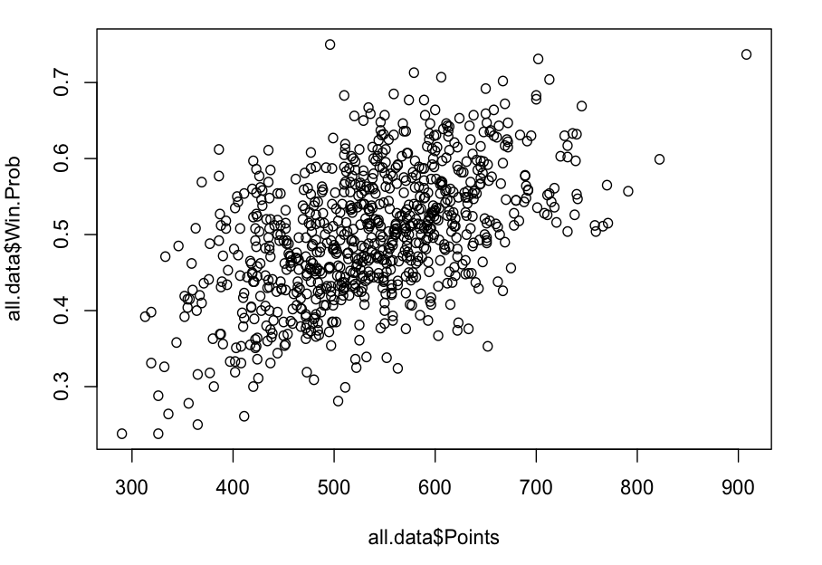
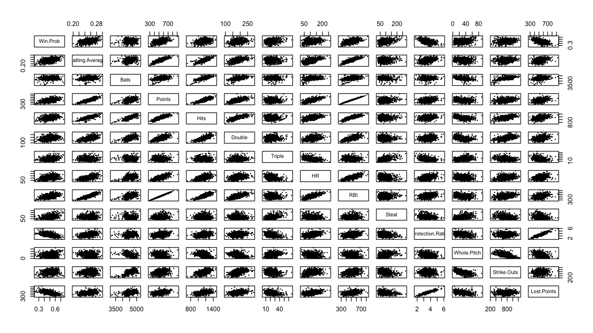
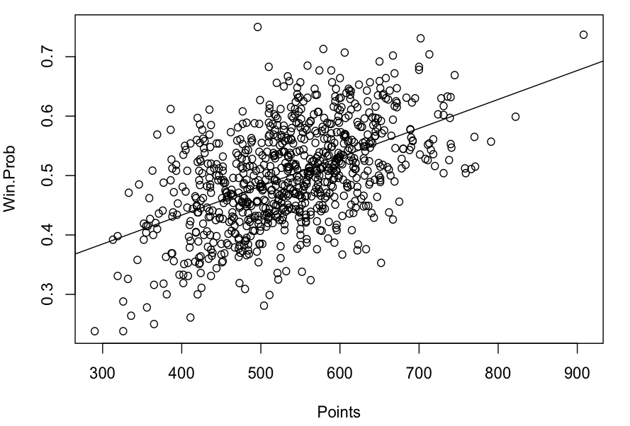
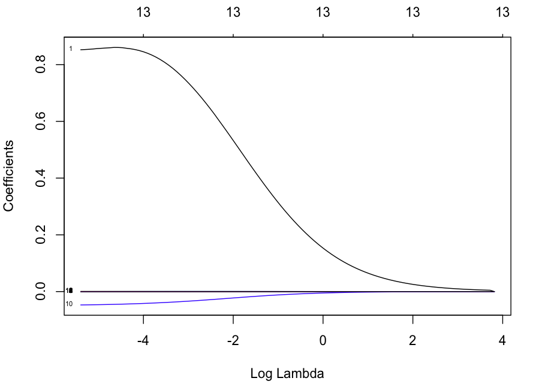
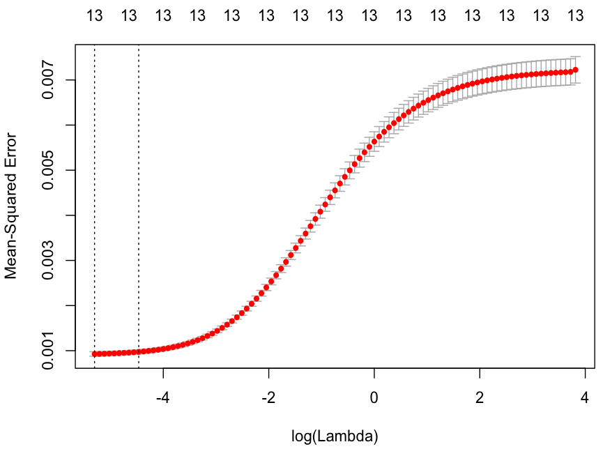
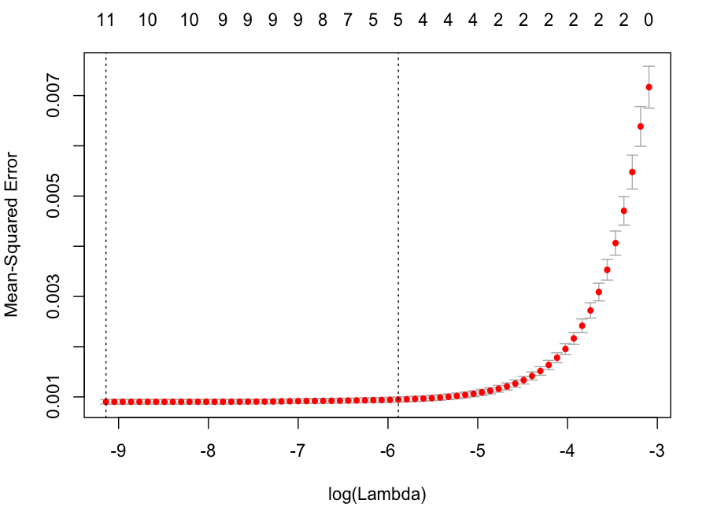
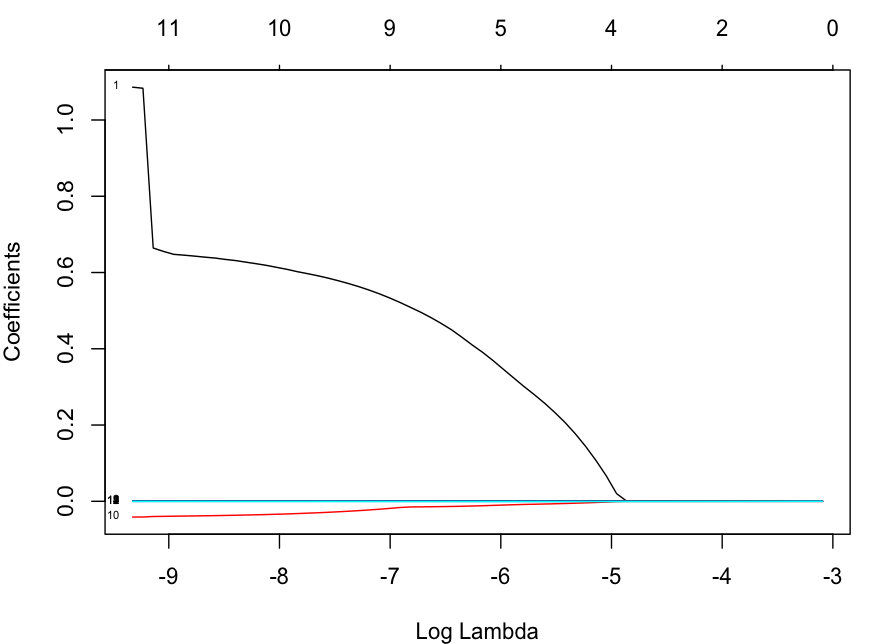

# **プロ野球データ解析**
t16366ak@sfc.keio.ac.jp

#### about this
授業・統計解析(2017年度 DS2 月4 小暮先生)での提出課題．データ解析なら何でもよいとのことだったので，どうせなら自分でデータ収集するところから始めてみようと思い，Pythonを用いてnpb公式サイトの過去のシーズンデータから約1000件取得(セ/パ x 67年 x 7チーム)し，Rを使って，統計的な解析を試みた．  

## プロ野球チームのシーズンデータの統計的解析

- 目次

    - 1. データの用意：スクレイピングで50年分のデータ取得
    - 2. Rでのデータ構造など
    - 3. データの可視化：変数間の関係性の俯瞰
    - 4. 単回帰分析
    - 5. 重回帰分析：変数選択
    - 6. 一般化線形モデル：RidgeとLassoによるフィッティング．
    - 7. 分類：サポートベクターマシンによるセ・パ分類

--

### 1. データの用意

- `getNPB.py` : NPBの公式サイトのデータ (http://npb.jp/bis/yearly/) からシーズンプロ野球データを取得するプログラム(3系)．`BeautifulSoup4`と`requests`ライブラリを用いて作成した．
ターミナルでディレクトリに移り実行．引数に年を入れるとその年のチーム毎の結果を返す．引数に何も指定しなかった場合は，1950年から2017年までのデータを全て取得し，`central_league.txt`と`pacific_league.txt`を出力する(こちらがメイン)

- 引数に `1998` を指定した場合．

```
$ python getNPB.py 1998

セントラル・リーグ1998年データを取得中...
年 リーグ 順位 チーム 全試 勝 負 引 勝率 打率 打数 得点 安打 二塁打 三塁打 本塁打 打点 盗塁 防御率 完投 脱三振 失点
1998 central 4 ヤクルトスワローズ 135 66 69 0 .489 .253 4504 493 1141 179 17 97 475 56 3.69 24 942 548
1998 central 2 中日ドラゴンズ 136 75 60 1 .556 .248 4417 488 1095 171 22 100 469 91 3.14 19 904 458
1998 central 5 広島東洋カープ 135 60 75 0 .444 .265 4630 578 1226 206 18 131 547 86 4.01 13 860 613
1998 central 1 横浜ベイスターズ 136 79 56 1 .585 .277 4706 642 1304 245 23 100 607 63 3.49 8 861 524
1998 central 3 読売ジャイアンツ 135 73 62 0 .541 .267 4520 632 1206 181 16 148 605 54 3.74 26 902 551
1998 central 6 阪神タイガース 135 52 83 0 .385 .242 4469 450 1080 197 16 86 422 28 3.95 9 749 589

パシフィック・リーグ1998年データを取得中...
年 リーグ 順位 チーム 全試 勝 負 引 勝率 打率 打数 得点 安打 二塁打 三塁打 本塁打 打点 盗塁 防御率 完投 脱三振 失点
1998 pacific 3 オリックス・ブルーウェーブ 135 66 66 3 .500 .2639 4561 586 1204 225 18 140 561 42 4.03 10 824 609
1998 pacific 6 千葉ロッテマリーンズ 135 61 71 3 .462 .271 4572 581 1240 241 35 102 556 80 3.70 29 750 563
1998 pacific 2 日本ハム・ファイターズ 135 67 65 3 .508 .255 4456 635 1136 175 19 150 599 91 3.83 28 703 571
1998 pacific 4 福岡ダイエーホークス 135 67 67 1 .500 .2637 4425 546 1167 209 22 100 507 89 4.02 14 719 596
1998 pacific 1 西武ライオンズ 135 70 61 4 .534 .270 4505 586 1217 185 28 115 543 145 3.66 16 903 559
1998 pacific 5 近鉄バファローズ 135 66 67 2 .496 .267 4495 593 1198 224 28 126 564 80 4.28 16 760 629
```

- 引数に指定しない場合．

```
$ python getNPB.py
セントラル・リーグ1950年データを取得中...
セントラル・リーグ1951年データを取得中...
セントラル・リーグ1952年データを取得中...
セントラル・リーグ1953年データを取得中...
セントラル・リーグ1954年データを取得中...
セントラル・リーグ1955年データを取得中...
セントラル・リーグ1956年データを取得中...
セントラル・リーグ1957年データを取得中...
セントラル・リーグ1958年データを取得中...
```

- `getNPB.py`

```
# /usr/bin/python
# -*- coding: utf-8 -*-

import requests
import sys
import lxml
import re
from bs4 import BeautifulSoup
# python getNPB.py
# -> generate .txt and .csv file including 1950~2016 data of both central and pacific league
# python getNPB.py 1996
# -> return league data of 1996 season

argvs = sys.argv
argc = len(argvs)

def getNpbData(year, league): # year is 1950 ~ 2016 / league is "central" or "pacific"

	outputs = {"txt":"", "csv":""}
	headers = {"User-Agent": "Mozilla/5.0 (Macintosh; Intel Mac OS X 10_12_4) AppleWebKit/537.36 (KHTML, like Gecko) Chrome/63.0.3239.84 Safari/537.36"}
	URL = "http://npb.jp/bis/yearly/" + league + "league_" + str(year) +".html"
	resp = requests.get(URL, timeout=2, headers=headers)
	soup = BeautifulSoup(resp.content, "lxml")
	tables = soup.find(class_='contentsBorder').find_all(class_='contentsPadding')
	# mainの<div>内のデータの<table>取得
	# テーブル3つ取得して２次元配列 => チーム毎にサーチをかけてfor文回す
	# team, all, win, lose, draw, winprob, batting ave, bats, get points, hits, double, triple, HR, RBI, steal, protection ratio, save, whole pitch, strikeouts, lost points のベクトルにする

	table_1_array = []
	table_2_array = []
	table_3_array = []

	table_1_tr = tables[0].find('table').find_all('tr') # tr-行要素の配列抽出
	for i in range(len(table_1_tr)):
		table_1_td = table_1_tr[i].find_all('td') #  td-列データ要素の配列抽出
		td_array = [] # init
		for n in range(len(table_1_td)): # 行方向にデータを配列に格納
			td_array.append(table_1_td[n].text)
		td_array.append(i) #順位の挿入
		table_1_array.append(td_array)

	table_2_tr = tables[1].find('table').find_all('tr')
	for i in range(len(table_2_tr)):
		table_2_td = table_2_tr[i].find_all('td')
		td_array = []
		for n in range(len(table_2_td)):
			td_array.append(table_2_td[n].text)
		table_2_array.append(td_array)

	table_3_tr = tables[2].find('table').find_all('tr')
	for i in range(len(table_3_tr)):
		table_3_td = table_3_tr[i].find_all('td')
		td_array = []
		for n in range(len(table_3_td)):
			td_array.append(table_3_td[n].text)
		table_3_array.append(td_array)

	del table_1_array[0]
	del table_2_array[0]
	del table_3_array[0]

	# sort by team name
	table_1_array.sort(key=lambda x:x[0])
	table_2_array.sort(key=lambda x:x[0])
	table_3_array.sort(key=lambda x:x[0])

	print(("セントラル" if league == "central" else "パシフィック") + "・リーグ" + str(year) + "年データを取得中...")

	# 行列要素数確認用
	# print("チーム数 : ",len(table_1_array)," teams")
	# print("チーム別成績 :  ",len(table_1_td)," elements")
	# print("攻撃成績 : ",len(table_2_td), " elements")
	# print("投手成績 : ",len(table_3_td), " elements")

	for i in range(len(table_1_array)):

		rank = table_1_array[i][-1]
		team = table_1_array[i][0]
		allGames = table_1_array[i][1]
		win = table_1_array[i][2]
		lose = table_1_array[i][3]
		draw = table_1_array[i][4]
		winProb = table_1_array[i][6]
		battingAve = table_2_array[i][1]
		bats = table_2_array[i][3]
		getPoints = table_2_array[i][4]
		hits = table_2_array[i][5]
		double = table_2_array[i][6]
		triple = table_2_array[i][7]
		hr = table_2_array[i][8]
		rbi = table_2_array[i][9]
		steal = table_2_array[i][10]
		protectionRatio = table_3_array[i][1]
		# save = table_3_array[i][5]
		wholePitch = table_3_array[i][6]
		strikeOuts = table_3_array[i][10]
		lostPoints = table_3_array[i][11]

		outputs["txt"] += str(year) +' '+ league +' '+ str(rank) +' '+ team + ' '+ allGames +' '+ win +' '+ lose +' '+ draw +' '+ winProb +' '+ battingAve +' '+ bats +' '+ getPoints +' '+ hits +' '+ double +' '+ triple +' '+ hr +' '+ rbi +' '+ steal +' '+ protectionRatio +' '+ wholePitch +' '+ strikeOuts +' '+ lostPoints + '\n'
		outputs["csv"] += str(year) + ',' + league + ',' + str(rank) +','+ team +','+ allGames +','+ win +','+ lose +','+ draw +','+ winProb +','+ battingAve +','+ bats +','+ getPoints +','+ hits +','+ double +','+ triple +','+ hr +','+ rbi +','+ steal +','+ protectionRatio +','+ wholePitch +','+ strikeOuts +','+ lostPoints + '\n'

	return outputs

# __init__#

if argc > 1: # 引数指定時

	output = "年 リーグ 順位 チーム 全試 勝 負 引 勝率 打率 打数 得点 安打 二塁打 三塁打 本塁打 打点 盗塁 防御率 完投 脱三振 失点\n"

	for n in range(argc-1):
		d = argvs[n+1]
		if d.isdecimal():
			if int(d) < 2017 and int(d) > 1949:
				print(output + getNpbData(int(d), "central")["txt"])
				print(output + getNpbData(int(d), "pacific")["txt"])
			else:
				print("Please put year number within 1950 to 2016.")
		else:
			print("put year(1950~2016) numbers as augments. if you put no arguments, it will generate '.txt' and '.csv' file of 1950~2016 datas on the same directory.")

else:

	head = "This is NPB datas. crawled by Atsuya Kobayashi 2018/01/03\n\n"
	output = "Year League Rank Team All-Games Win Lose Draw Win-Prob Batting-Average Bats Points Hits Double Triple HR RBI Steal Protection-Ratio Whole-Pitch Strike-Outs Lost-Points\n"
	csvoutput = "Year,League,Rank,Team,All-Games,Win,Lose,Draw,Win-Prob,Batting-Average,Bats,Points,Hits,Double,Triple,HR,RBI,Steal,Protection-Ratio,Whole-Pitch,Strike-Outs,Lost-Points\n"

	for year in range(1950, 2017):
		res = getNpbData(year, "central")
		output += res["txt"]
		csvoutput += res["csv"]

	open('central_league.csv', 'w').write(csvoutput)
	print("central_league.csv を出力中...")
	open('central_league.txt', 'w').write(output)
	print("central_league.txt を出力中...")

	for year in range(1950, 2017):
		res = getNpbData(year, "pacific")
		output += res["txt"]
		csvoutput += res["csv"]

	open('pacific_league.csv', 'w').write(csvoutput)
	print("pacific_league.csv を出力中...")
	open('pacific_league.txt', 'w').write(output)
	print("pacific_league.txt を出力中...")

```

### 2. Rでのデータ解析
pythonのスクレイピングにより，1950年~2017年の67年x6チームx2リーグのデータが取得できたので，そのデータを用いてデータ解析をしてみようと思う．  
データの行列は，列方向にチーム，行方向に  

```
年 リーグ 順位 チーム名 全試 勝 負 引 勝率 打率 打数 得点 安打 二塁打 三塁打 本塁打 打点 盗塁 防御率 完投 脱三振 失点
```

となっているので，各チームの年間打撃成績や投手成績を用いて勝率を予測することにする．

- Rで表のデータを読み込む  

```
pacific.data = read.table("pacific_league.txt", header=T)
central.data = read.table("central_league.txt", header=T) 
# TはTrue 一行目にヘッダー情報があることを意味する

```

- `head()`で5行文読んだデータの確認

```
> head(pacific.data, 5)
  Year  League Rank             Team All.Games Win Lose Draw Win.Prob Batting.Average Bats Points Hits Double Triple  HR RBI Steal Protection.Ratio Whole.Pitch Strike.Outs Lost.Points
1 1950 pacific    2     南海ホークス       120  66   49    5    0.574           0.279 4232    645 1181    211     43  88 583   225             3.38          38         469         495
2 1950 pacific    3     大映スターズ       120  62   54    4    0.534           0.260 4152    534 1078    181     22  91 491    82             3.70          65         457         516
3 1950 pacific    6 東急フライヤーズ       120  51   69    0    0.425           0.256 4164    524 1067    169     27  87 464   143             4.52          59         428         660
4 1950 pacific    1   毎日オリオンズ       120  81   34    5    0.704           0.286 4245    713 1212    209     43 124 640   195             3.42          58         462         512
5 1950 pacific    5 西鉄クリッパース       120  51   67    2    0.432           0.254 4136    493 1050    164     23  79 451   115             3.87          52         407         583

> head(central.data, 5)
  Year  League Rank           Team All.Games Win Lose Draw Win.Prob Batting.Average Bats Points Hits Double Triple  HR RBI Steal Protection.Ratio Whole.Pitch Strike.Outs Lost.Points
1 1950 central    2 中日ドラゴンズ       137  89   44    4    0.669           0.274 4787    745 1311    229     54 144 693   179             3.73          72         558         597
2 1950 central    7 国鉄スワローズ       138  42   94    2    0.309           0.244 4626    480 1131    142     37  66 436   104             4.67          42         551         790
3 1950 central    5 大洋ホエールズ       140  69   68    3    0.504           0.273 4972    759 1356    258     35 111 694   180             4.47          60         467         761
4 1950 central    4 大阪タイガース       140  70   67    3    0.511           0.270 4960    766 1337    234     46 120 706   147             4.19          60         352         696
5 1950 central    8     広島カープ       138  41   96    1    0.299           0.243 4703    511 1145    162     37  81 463    74             5.20          59         401         877


```

- `データフレームオブジェクト$列ラベル`でデータにアクセスできる

```
> head(central.data$RBI, 5)
[1] 693 436 694 706 463

```

- `summary()`関数で各データの情報をサクっと確認

```
> summary(pacific.data$Hits)
   Min. 1st Qu.  Median    Mean 3rd Qu.    Max. 
    713    1088    1148    1150    1217    1461 
> summary(central.data$Hits)
   Min. 1st Qu.  Median    Mean 3rd Qu.    Max. 
    831    1066    1135    1134    1205    1458 
```

- データフレームの結合
セ・リーグとパ・リーグを両方扱うために，`all.data`というテーブルをあらたに作成する．  
`merge()`関数によって二つのデータを結合する．データを残すために，`all=T`を引数に追加．

```
> all.data = merge(pacific.data, central.data, all=T)

```

### 3. 変数間の関係性を俯瞰する
データをプロットするなどして可視化する．

- **散布図**

```
> plot(all.data$Points, all.data$Win.Prob)

```


パ・リーグとセ・リーグ両方の年間年間得点数と年間勝率をプロット．当たり前だがつよい正の相関がある．


- データ全体の関係をある程度把握するために，**対散布図**をプロットする．

すべてのデータでやるととんでもないことになるので，意味のアリそうなもの(チーム名や勝敗数などは抜く)だけ選ぶ．重なりすぎて見えにくいので文字サイズ`cex`を0.3倍し，プロットするマークは小さい点に指定(`pch=20`)

```
> pairs(all.data[9:22], cex=0.3,pch=20)

```

各データ間の関係がひと目で確認できる．ここで，総得点(`$Points`)と打点(`$RBI`)や，総失点(`$LostPoints`)と防御率(`$ProtectionRate`)は完全に比例していることがわかる(あたりまえ)．これはそもそもの値を算出する時に片方の値を用いているからである．総得点と打点の相関係数は0.9936991であった`> cor(all.data$Points, all.data$RBI)`

### 4. 単回帰分析
データ間の関係が見て取れたところで，回帰分析を行う．

先程プロットした，各チームの勝率`Win.Prob`と総得点数`Points`を用いる．回帰分析は`lm()`関数であり，`formula`に`目的変数~説明変数`，`data=`にデータのオブジェクトを指定する．

```
> lm1 = lm(formula = Win.Prob ~ Points, data = all.data)
> # 回帰分析の結果をlm1というオブジェクトに格納
> lm1
>
>Coefficients:
(Intercept)       Points  
  0.2386876    0.0004867 
>
> summary(lm1) # lm1の内容をサクっと確認
>
>Residuals:
      Min        1Q    Median        3Q       Max 
-0.203044 -0.051573 -0.002033  0.052692  0.269888 

Coefficients:
             Estimate Std. Error t value Pr(>|t|)    
(Intercept) 2.387e-01  1.533e-02   15.56   <2e-16 ***
Points      4.867e-04  2.817e-05   17.28   <2e-16 ***
---
Signif. codes:  0 ‘***’ 0.001 ‘**’ 0.01 ‘*’ 0.05 ‘.’ 0.1 ‘ ’ 1

Residual standard error: 0.0729 on 829 degrees of freedom
Multiple R-squared:  0.2648,	Adjusted R-squared:  0.2639 
F-statistic: 298.5 on 1 and 829 DF,  p-value: < 2.2e-16

```

`Coefficients`は係数であり，`Intercept`は切片のことであるため，回帰した結果の式が，
\begin{equation}y = 0.0004867x + 0.2386876\end{equation}
であることを意味する．決定係数が0.2648なので，あまり説明は出来ていない気がする．プロットに重ねる`abline()`と，

```
> plot(formula = Win.Prob ~ Hits, data = all.data)
> abline(lm1)

```

このようになる．

### 5. 重回帰分析

より多い変数を用いて回帰分析を行う．総安打数，二塁打，三塁打，ホームランなどの複数の打撃成績を用いて説明をしてみる．

```
> mlm1 = lm(formula = Win.Prob ~ Hits + Double + Triple + HR , data = all.data)
> 
> summary(mlm1)
> 
Residuals:
      Min        1Q    Median        3Q       Max 
-0.227481 -0.050902 -0.002283  0.053477  0.239882 

Coefficients:
              Estimate Std. Error t value Pr(>|t|)    
(Intercept)  1.683e-01  3.029e-02   5.555 3.74e-08 ***
Hits         1.543e-04  4.150e-05   3.719 0.000213 ***
Double      -1.352e-04  1.343e-04  -1.007 0.314179    
Triple       3.726e-03  3.247e-04  11.477  < 2e-16 ***
HR           8.087e-04  8.595e-05   9.410  < 2e-16 ***
---
Signif. codes:  0 ‘***’ 0.001 ‘**’ 0.01 ‘*’ 0.05 ‘.’ 0.1 ‘ ’ 1

Residual standard error: 0.07381 on 826 degrees of freedom
Multiple R-squared:  0.249,	Adjusted R-squared:  0.2454 
F-statistic: 68.47 on 4 and 826 DF,  p-value: < 2.2e-16

```

次は，投手成績も用いて分析を行う．  
総得点`Points`と総失点`Lost.Points`を用いて分析を行う．

```
> mlm2 = lm(formula = Win.Prob ~ Points + Lost.Points , data = all.data)
> 
> sumary(mlm2)
> 
Residuals:
      Min        1Q    Median        3Q       Max 
-0.089515 -0.021369 -0.001814  0.020842  0.111441 

Coefficients:
              Estimate Std. Error t value Pr(>|t|)    
(Intercept)  5.071e-01  7.698e-03   65.88   <2e-16 ***
Points       7.798e-04  1.265e-05   61.65   <2e-16 ***
Lost.Points -7.931e-04  1.265e-05  -62.72   <2e-16 ***
---
Signif. codes:  0 ‘***’ 0.001 ‘**’ 0.01 ‘*’ 0.05 ‘.’ 0.1 ‘ ’ 1

Residual standard error: 0.03042 on 828 degrees of freedom
Multiple R-squared:  0.8721,	Adjusted R-squared:  0.8718 
F-statistic:  2824 on 2 and 828 DF,  p-value: < 2.2e-16

```
かなりあてはまりのいいものが出てきた．得点には正の傾き，失点には負の傾きがのっていることが分かる．

#### モデル選択

AICを用いて変数の選択をしてみる．その前に，分析に使えそうなデータのみでデータを再構築する．(勝率の推定に対して総試合数と勝利数がわかってしまっては意味がないので)

```
> new.data = subset(all.data, select = 9:22)
> 
> names(new.data)
 [1] "Win.Prob"         "Batting.Average"  "Bats"             "Points"           "Hits"            
 [6] "Double"           "Triple"           "HR"               "RBI"              "Steal"           
[11] "Protection.Ratio" "Whole.Pitch"      "Strike.Outs"      "Lost.Points"    

```

この中から一度全てを選択して重回帰分析をし，**ステップワイズ法**でそこから減らしていきAICを基に変数選択をする

```
> names = names(new.data)[-c(1)]
> names
 [1] "Batting.Average"  "Bats"             "Points"           "Hits"             "Double"          
 [6] "Triple"           "HR"               "RBI"              "Steal"            "Protection.Ratio"
[11] "Whole.Pitch"      "Strike.Outs"      "Lost.Points"     
> form = paste(names, collapse="+")
> form
[1] "Batting.Average+Bats+Points+Hits+Double+Triple+HR+RBI+Steal+Protection.Ratio+Whole.Pitch+Strike.Outs+Lost.Points"
> forms = as.formula(paste("Win.Prob~", form))
> forms
Win.Prob ~ Batting.Average + Bats + Points + Hits + Double + 
    Triple + HR + RBI + Steal + Protection.Ratio + Whole.Pitch + 
    Strike.Outs + Lost.Points
> all.lm = lm(forms, data = new.data)
> summary(all.lm)

Call:
lm(formula = forms, data = new.data)

Residuals:
      Min        1Q    Median        3Q       Max 
-0.081705 -0.020341 -0.002297  0.020167  0.085677 

Coefficients:
                   Estimate Std. Error t value Pr(>|t|)    
(Intercept)      -3.878e-01  2.636e-01  -1.471 0.141659    
Batting.Average   4.145e+00  1.040e+00   3.987 7.30e-05 ***
Bats              1.645e-04  5.996e-05   2.744 0.006199 ** 
Points            8.127e-04  1.514e-04   5.367 1.04e-07 ***
Hits             -7.930e-04  2.365e-04  -3.353 0.000837 ***
Double           -3.040e-05  6.087e-05  -0.499 0.617675    
Triple           -4.963e-05  1.622e-04  -0.306 0.759727    
HR                1.373e-04  6.019e-05   2.281 0.022818 *  
RBI              -1.501e-04  1.626e-04  -0.923 0.356180    
Steal             3.672e-05  3.611e-05   1.017 0.309433    
Protection.Ratio -4.012e-02  9.455e-03  -4.244 2.45e-05 ***
Whole.Pitch       7.945e-05  9.889e-05   0.803 0.421934    
Strike.Outs       4.209e-05  9.878e-06   4.261 2.28e-05 ***
Lost.Points      -4.897e-04  6.892e-05  -7.105 2.62e-12 ***
---
Signif. codes:  0 ‘***’ 0.001 ‘**’ 0.01 ‘*’ 0.05 ‘.’ 0.1 ‘ ’ 1

Residual standard error: 0.02959 on 817 degrees of freedom
Multiple R-squared:  0.8807,	Adjusted R-squared:  0.8788 
F-statistic: 463.8 on 13 and 817 DF,  p-value: < 2.2e-16

> step(new.data, direction="backward") #ひとつずつ抜いて結果だす

```
```
Coefficients:
     (Intercept)   Batting.Average              Bats            Points              Hits  
      -3.982e-01         4.253e+00         1.690e-04         6.697e-04        -8.243e-04  
              HR             Steal  Protection.Ratio       Strike.Outs       Lost.Points  
       1.327e-04         4.989e-05        -4.301e-02         3.633e-05        -4.738e-04  

```

結果的には，**打率，打数，得点，安打数，ホームラン数，盗塁数，防御率，脱三振，失点数** の9つを用いるときが最も良いらしい．R2乗決定係数は0.8804となる．

### 6. 一般化線形モデルの活用
4,5で行った回帰分析は，そもそものデータが推定された値から正規分布に基いて連続的にバラつくことが仮定されている．ので，カテゴリやカウントデータは適していない(0以下にならないデータに対して正規分布の尤度を見るのはおかしい?)とのこと．そこで，他の分布とリンク関数を指定する関数`glm()`を用いて一般**化**線形モデルをつくってみる．

```

> glm(モデル式, family = 目的変数の分布, data = データフレーム)
# リンク関数も指定する場合
> glm(モデル式, family = 目的変数の分布(link = リンク関数), data = データフレーム)

```

説明変数は一つで，先ほどの単回帰分析と比較してみる．カウントデータではあるが，平均値も十分大きい数値であるため，分布は　正規分布を用いる．
(http://tjo.hatenablog.com/entry/2013/09/23/232814)

- デフォルトの一般化線形モデル`glm()`

```
> glm(formula = Win.Prob ~ Points, family = gaussian ,data = all.data)
```

- **Ridge**と**Lasso**，**Elastic Net** `glmnet()`

```
> install.packages(glmnet)
> library(glmnet)
> glmnet( x=exp_vars, y=target_var, family="gaussian", alpha=0)
> # alphaにridgeとlassoをどれくらい混ぜるか(?)を指定する．

```

#### Ridge回帰をかける  
`glmnet()`を用いるために，データをデータフレームから`matrix`型に変換．説明変数群と目的変数`all.data$Win.Prob`に分ける．その後，`glm()`を実行

```
> glm.x = as.matrix(all.data[10:22])
> glm.y= as.matrix(all.data[9])
> ridge1 = glmnet( x= glm.x, y= glm.y, family="gaussian", alpha=0)

```
ここで`ridge1$beta`を実行し，デフォルトで100分割されている各λにおけるパラメータ推定を行うと次のようなパラメータ推定値の結果が各λについて返ってくる．

```
Batting.Average   8.551297e-01  8.540041e-01  8.531376e-01  8.524238e-01
Bats             -3.156353e-05 -3.175057e-05 -3.188684e-05 -3.195879e-05
Points            2.913910e-04  2.969725e-04  3.024754e-04  3.081795e-04
Hits              1.356112e-05  1.129856e-05  8.956835e-06  6.516034e-06
Double            2.129514e-05  1.755803e-05  1.390705e-05  1.015025e-05
Triple            2.124596e-04  2.031005e-04  1.940111e-04  1.848767e-04
HR                2.071145e-04  2.016156e-04  1.961211e-04  1.903862e-04
RBI               2.503917e-04  2.527315e-04  2.548999e-04  2.567653e-04
Steal             1.166236e-04  1.137216e-04  1.108938e-04  1.080936e-04
Protection.Ratio -4.644616e-02 -4.667494e-02 -4.688717e-02 -4.706981e-02
Whole.Pitch       1.861435e-04  1.800274e-04  1.742370e-04  1.688470e-04
Strike.Outs       3.586531e-05  3.593506e-05  3.600485e-05  3.608471e-05
Lost.Points      -3.986572e-04 -4.006614e-04 -4.024950e-04 -4.042558e-04

```
各λの値によってどれくらいバリアンスがおさえられたかをplotして確認してみる

```
> plot(ridge1, xvar="lambda", label=TRUE)

```

ちゃんと係数の値が0に近づいていっているのが確認できる．1番大きく係数が設定されていた①はチーム打率`Batting.Average`である．負の方向に少し触れている⑩はチーム失点`Lost.Points`なので，係数が負なのは当たり前である．  

次に，**交差検証(10-fold-cross validation)**によってどのλの値が最もいいか選択してみる.
`cv.glmnet()`という関数で自動的に交差検証してくれるらしい．foldはデフォルトが10．

```
> ridgeCV1 <- cv.glmnet( x=glm.x, y=glm.y, family="gaussian", alpha=0 )
> # ridgeCV1オブジェクトに結果を格納
> plot(ridgeCV1)
> # 結果をプロット
```

左端の線はMSE(平均二乗誤差)が最小になるときのlogλの値に引いてある．あたりまえだが，λを増やして罰則を強くしていくと誤差も大きくなる(バイアスが上がる?)．  

MSEが最小になるときのλに対応する推定パラメータは，

```
> coef(ridgeCV1, s="lambda.min")
> 
(Intercept)       4.344601e-01
Batting.Average   8.531376e-01
Bats             -3.188684e-05
Points            3.024754e-04
Hits              8.956835e-06
Double            1.390705e-05
Triple            1.940111e-04
HR                1.961211e-04
RBI               2.548999e-04
Steal             1.108938e-04
Protection.Ratio -4.688717e-02
Whole.Pitch       1.742370e-04
Strike.Outs       3.600485e-05
Lost.Points      -4.024950e-04
```
である．失点数`Lost.Points`と防御率`Protection.Ratio`が勝率の推定に対しての係数が負なのはわかるが，打数`Bats`も負なのが以外というか面白い．チーム打率`Batting.Average`が最も説明力のある変数であった．

#### Lasso回帰をかける
Lassoは**Least Absolute Shrinkage and Selection Operator**の略である．`glmnet()`に渡す引数の`alpha`を1にするとlasso回帰をかけることが出来る．Ridgeと同様に交差検証をしてλの値を探す．

```
> lasso1 = glmnet( x= glm.x, y= glm.y, family="gaussian", alpha=1)
> lassoCV1 <- cv.glmnet( x=glm.x, y=glm.y, family="gaussian", alpha=1)
> 
> plot(lassoCV1)
```

λを上げていくとMSEも上がっていく図になるが，リッジと大きくことなる点は，上にかいてある変数の種類(non zero変数)がどんどん減っていっているところである．Lassoは正則化によって係数を0にする働きがあるため，このように変数選択能力がある．  

ここで，どのように係数が減っていき，変数の削減が行われていったかを見てみる．

```
> plot(lasso1, xvar="lambda", label=TRUE)
```

なんと，最も影響力のあった①`Batting.Average`がlogλ=-5あたりで
消されてしまい，最終的に残ったのは③`Points`と⑬`Lost.Points`であった．その前までは生き残っていたのは防御率`Protection.Ratio`である．  
(`lasso1$beta`でλを68等分した全てで検証してくれるため，そこで確認)  
MSEが最小になるときのλのときの推定パラメータは，

```
> coef(lassoCV1, s="lambda.min")
> 14 x 1 sparse Matrix of class "dgCMatrix"
                             1
(Intercept)       4.818945e-01
Batting.Average   6.642046e-01
Bats             -3.049405e-05
Points            6.604636e-04
Hits             -3.487568e-06
Double           -3.517549e-05
Triple            .           
HR                1.223005e-04
RBI               .           
Steal             4.753827e-05
Protection.Ratio -3.984517e-02
Whole.Pitch       9.265962e-05
Strike.Outs       3.461309e-05
Lost.Points      -4.913019e-04

```
であった．

- [参考サイト](http://highschoolstudent.hatenablog.com/entry/2015/02/08/142354)

### 7. 分類：SVMによる分類
サポートベクターマシンを用いた分類をやってみようと思う．ここでは，データのリーグがセ・リーグなのかパ・リーグなのか =ラベル`League`の二値分類を，いままで説明変数として用いてきたデータから分類してみようと思う．

まず，用いるデータにチーム名`Team`がFactor(カテゴリカル変数)として入っていては意味が無い(当たり前だがそれでやったら分類精度100%だった)ので，取り除いたデータフレームを作成する．

```
> svm.data = subset(all.data, select = 2:22) #基のデータの2列目以降
> svm.data = subset(svm.data, select = c(-Team)) #Team列を削除
> names(svm.data)
 [1] "League"           "Rank"             "All.Games"        "Win"             
 [5] "Lose"             "Draw"             "Win.Prob"         "Batting.Average" 
 [9] "Bats"             "Points"           "Hits"             "Double"          
[13] "Triple"           "HR"               "RBI"              "Steal"           
[17] "Protection.Ratio" "Whole.Pitch"      "Strike.Outs"      "Lost.Points"     
```
そして，全データ831個のうち10%をテストデータに回すので，乱数を指定して83個をテストデータとしてインデックスを決め．SVM用のパッケージをインストールする．

```
> set.seed(1)
> svm.train = sample(1:nrow(svm.data), 748)
> svm.test = sample(1:nrow(svm.data)[-train], 83)
> install.packages("e1071")
> library(e1071)
```
パラメータチューニングを行い，10-fold-Cross Validationの結果もっとも当てはまりの良かったパラメータをもつモデルを選択する．

```
> tune.out = tune(svm, League~., data=svm.data[train,],kernel="linear",decision.value=T,scale=TRUE,ranges=list(cost=c(0.0001,0.001,0.1,1,10,50,100)))
> svm.fit = tune.out$best.model
> summary(svm.fit)

Parameters:
   SVM-Type:  C-classification 
 SVM-Kernel:  linear 
       cost:  0.1 
      gamma:  0.05263158 

```
その後，テストデータを用いて結果を出し，評価．

```
> svm.pred.train = predict(svm.fit, newdata=svm.data[train,], decision.values=T)
> svm.pred.test = predict(svm.fit, newdata=svm.data[test,], decision.values=T)
> (table.svm.train = table(svm.pred.train, svm.data[train, "League"]))
              
svm.pred.train pacific central
       pacific     254     103
       central     119     272
> (table.svm.test = table(svm.pred.test, svm.data[test, "League"]))
             
svm.pred.test pacific central
      pacific      26      13
      central      20      24
```
なんともいえない結果になった．各評価基準は，  

- 正解率(Accuracy) : **0.6024096**
- 適合率(Precision) : **0.65**
- 再現率(Recall) : **0.5652174**
- F値(F-measure) : **0.6046512**

であった．

---

#### おわりに

以上で一連のデータ解析を終了する．より統計学の基礎的な部分を固めてから，このような実習を行っていきたいと感じた．

#### 参考文献
- 統計解析[DS2]授業資料 / 小暮厚之先生 - 慶應義塾大学総合政策学部
- 「Rによるデータサイエンス」 / 金明哲 - 森北出版株式会社
- 「データ解析のための統計モデリング入門」/ 久保拓弥 - 岩波書店
- 「基本統計学」/ 宮川公男 - 有斐閣
- [六本木で働くデータサイエンティストのブログ：2013-09-23
「使い分け」ではなく「妥当かどうか」が大事：重回帰分析＆一般化線形モデル選択まわりの再まとめ](http://tjo.hatenablog.com/entry/2013/09/23/232814#f4)
- [biostatistics：Rによる重回帰分析](https://stats.biopapyrus.jp/glm/mlm-r.html)
- [marketechlabo：Rにおける代表的な一般化線形モデル（GLM）の実装ライブラリまとめ](https://www.marketechlabo.com/r-glm-libraries/)
- [はてなブログ：リッジ/Ridge回帰、Lasso回帰、Elastic Net (R - glmnet)](http://highschoolstudent.hatenablog.com/entry/2015/02/08/142354)
- [Web就活日記：R言語でSVM(Support Vector Machine)による分類学習](http://yut.hatenablog.com/entry/20120827/1346024147)
- [Qiita：PythonとBeautiful Soupでスクレイピング](https://qiita.com/itkr/items/513318a9b5b92bd56185)
- [Qiita：python3でwebスクレイピング(Beautiful Soup)](https://qiita.com/matsu0228/items/edf7dbba9b0b0246ef8f)
- [一般社団法人日本野球機構公式Webサイト](http://npb.jp/bis/yearly/)
